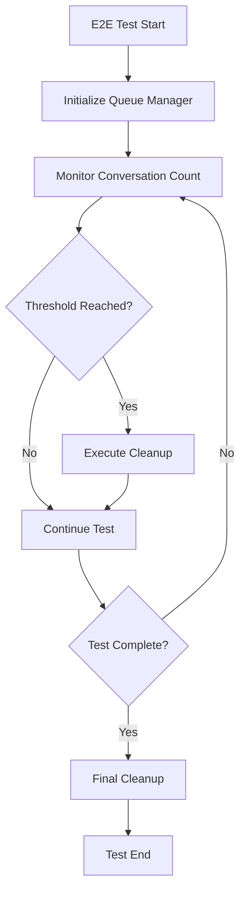

# Automatic Queue Management Integration Plan

## Overview

This document outlines the complete integration plan for automatically incorporating the Operator Queue Manager into the E2E testing system. The goal is to seamlessly manage conversation queues without manual intervention, ensuring optimal performance during automated test runs.

## Integration Architecture



## Implementation Phases

### Phase 1: Script Injection System

#### 1.1 Create Queue Manager Module
```javascript
// File: e2e/lib/operator-queue-manager.js
import { readFileSync } from 'fs';
import { join, dirname } from 'path';
import { fileURLToPath } from 'url';

const __filename = fileURLToPath(import.meta.url);
const __dirname = dirname(__filename);

class OperatorQueueManager {
    constructor(options = {}) {
        this.options = {
            autoCleanupThreshold: 10,
            preserveLatest: 2,
            cleanupInterval: 5,
            enableAutoCleanup: true,
            ...options
        };
        
        // Load the queue cleaner script
        this.cleanerScript = readFileSync(
            join(__dirname, '../scripts/operator-queue-cleaner.js'), 
            'utf8'
        );
        
        this.conversationCount = 0;
        this.cleanupCount = 0;
    }
    
    async injectScript(page) {
        // Inject the queue cleaner script into the page
        await page.evaluate(this.cleanerScript);
        
        // Add monitoring capabilities
        await page.evaluate(() => {
            window.OperatorQueueManager = {
                getConversationCount: () => {
                    return document.querySelectorAll('.group.relative > button').length;
                },
                getLastCleanup: () => window.__lastCleanupTime || null
            };
        });
    }
    
    async checkAndCleanup(page) {
        const count = await page.evaluate(() => 
            window.OperatorQueueManager.getConversationCount()
        );
        
        this.conversationCount = count;
        
        if (count >= this.options.autoCleanupThreshold && this.options.enableAutoCleanup) {
            console.log(`[Queue Manager] Threshold reached (${count}/${this.options.autoCleanupThreshold}), starting cleanup...`);
            return await this.executeCleanup(page);
        }
        
        return false;
    }
    
    async executeCleanup(page, preserveLatest = null) {
        const preserve = preserveLatest || this.options.preserveLatest;
        
        const result = await page.evaluate(async (preserve) => {
            // Modified cleanup to preserve latest conversations
            const buttons = document.querySelectorAll('.group.relative > button');
            const totalCount = buttons.length;
            
            if (totalCount <= preserve) {
                return { 
                    success: false, 
                    message: 'Not enough conversations to cleanup',
                    deleted: 0
                };
            }
            
            // Process all except the latest N conversations
            const buttonsToDelete = Array.from(buttons).slice(0, -preserve);
            
            // Use the injected processButtons function with modifications
            let successCount = 0;
            for (let i = 0; i < buttonsToDelete.length; i++) {
                try {
                    // Reuse the existing deletion logic
                    await window.OperatorQueueCleaner.processSingleButton(buttonsToDelete[i]);
                    successCount++;
                } catch (err) {
                    console.error(`Failed to delete conversation ${i}:`, err);
                }
            }
            
            window.__lastCleanupTime = Date.now();
            
            return {
                success: true,
                deleted: successCount,
                remaining: preserve,
                timestamp: new Date().toISOString()
            };
        }, preserve);
        
        this.cleanupCount++;
        console.log(`[Queue Manager] Cleanup complete:`, result);
        
        return result;
    }
}

export default OperatorQueueManager;
```

#### 1.2 Integration with OperatorMessageSender
```javascript
// Modifications to e2e/lib/send_and_wait_for_response.js

import OperatorQueueManager from './operator-queue-manager.js';

class OperatorMessageSenderWithResponse {
    constructor(options = {}) {
        // ... existing code ...
        
        // Initialize queue manager
        this.queueManager = new OperatorQueueManager({
            autoCleanupThreshold: options.queueCleanupThreshold || 10,
            preserveLatest: options.preserveLatestConversations || 2,
            enableAutoCleanup: options.enableQueueAutoCleanup !== false
        });
    }
    
    async init() {
        // ... existing connection code ...
        
        // Inject queue manager after connecting
        await this.queueManager.injectScript(this.page);
        console.log('[Queue Manager] Injected into Operator page');
    }
    
    async sendMessage(message, options = {}) {
        // Check queue before sending message
        await this.queueManager.checkAndCleanup(this.page);
        
        // ... existing send message code ...
    }
}
```

### Phase 2: E2E System Integration

#### 2.1 Modify OperatorE2EExecutor
```javascript
// Modifications to e2e/operator.execute_e2e.js

class OperatorE2EExecutor {
    constructor(qaFilePath, options = {}) {
        // ... existing code ...
        
        // Queue management options
        this.queueManagementOptions = {
            enableAutoCleanup: options.enableQueueCleanup !== false,
            cleanupThreshold: options.queueCleanupThreshold || 10,
            cleanupInterval: options.queueCleanupInterval || 5,
            preserveLatest: options.preserveLatestConversations || 2,
            cleanupOnIterationComplete: options.cleanupOnIterationComplete || true
        };
    }
    
    async runE2ETest() {
        // ... existing initialization ...
        
        // Pass queue options to operator sender
        this.operatorSender = new OperatorMessageSenderWithResponse({
            port: this.chromePort,
            session: this.tmuxSession,
            logger: this.log.bind(this),
            ...this.queueManagementOptions
        });
        
        // ... existing code ...
    }
    
    async runIteration(iteration) {
        // ... existing iteration code ...
        
        // Cleanup after iteration if configured
        if (this.queueManagementOptions.cleanupOnIterationComplete && 
            iteration % this.queueManagementOptions.cleanupInterval === 0) {
            
            console.log(`[E2E] Performing scheduled queue cleanup after iteration ${iteration}`);
            await this.operatorSender.queueManager.executeCleanup(
                this.operatorSender.page
            );
        }
        
        // ... rest of iteration code ...
    }
}
```

#### 2.2 Configuration File Support
```javascript
// File: e2e/config/queue-management.json
{
    "queueManagement": {
        "enabled": true,
        "autoCleanup": {
            "enabled": true,
            "threshold": 10,
            "preserveLatest": 2,
            "interval": 5
        },
        "triggers": {
            "onIterationComplete": true,
            "onHealthCheckFail": true,
            "onMemoryThreshold": {
                "enabled": true,
                "thresholdMB": 500
            }
        },
        "advanced": {
            "deletePattern": "completed",
            "preservePatterns": ["error", "investigating"],
            "exportBeforeDelete": false,
            "archivePath": "./logs/archived-conversations"
        }
    }
}
```

### Phase 3: Advanced Features

#### 3.1 Intelligent Cleanup Strategies
```javascript
// File: e2e/lib/cleanup-strategies.js

export class CleanupStrategies {
    static async smartCleanup(page, options = {}) {
        // Analyze conversation states
        const conversations = await page.evaluate(() => {
            const buttons = document.querySelectorAll('.group.relative > button');
            return Array.from(buttons).map((btn, index) => {
                const text = btn.textContent || '';
                const parent = btn.closest('.group');
                
                return {
                    index,
                    text,
                    hasError: text.toLowerCase().includes('error'),
                    isActive: parent?.classList.contains('active'),
                    timestamp: parent?.dataset.timestamp || null
                };
            });
        });
        
        // Determine which to delete based on strategy
        const toDelete = conversations.filter(conv => {
            if (conv.hasError && options.preserveErrors) return false;
            if (conv.isActive) return false;
            if (options.preserveRecent && conv.index >= conversations.length - options.preserveRecent) return false;
            
            return true;
        });
        
        // Execute targeted deletion
        return await this.deleteSpecificConversations(page, toDelete.map(c => c.index));
    }
    
    static async deleteByAge(page, maxAgeMinutes = 30) {
        // Delete conversations older than specified age
        const cutoffTime = Date.now() - (maxAgeMinutes * 60 * 1000);
        
        return await page.evaluate(async (cutoff) => {
            // Implementation for age-based deletion
            // ...
        }, cutoffTime);
    }
    
    static async deleteByPattern(page, pattern) {
        // Delete conversations matching specific patterns
        return await page.evaluate(async (pat) => {
            const regex = new RegExp(pat, 'i');
            // Find and delete matching conversations
            // ...
        }, pattern);
    }
}
```

#### 3.2 Health-Based Triggers
```javascript
// Integration with health-check.js

class HealthCheckSystem {
    constructor(options = {}) {
        // ... existing code ...
        
        this.queueManager = options.queueManager;
    }
    
    async performHealthCheck(iteration = 0) {
        const checks = await this.runAllChecks();
        
        // Trigger cleanup on health issues
        if (!checks.healthy && this.queueManager) {
            console.log('[Health] Triggering queue cleanup due to health issues');
            
            if (checks.system && !checks.system.healthy) {
                // System resource issues - aggressive cleanup
                await this.queueManager.executeCleanup(this.page, 0);
            } else {
                // Other issues - normal cleanup
                await this.queueManager.executeCleanup(this.page);
            }
        }
        
        return checks;
    }
}
```

### Phase 4: Monitoring and Analytics

#### 4.1 Queue Metrics Collection
```javascript
// File: e2e/lib/queue-metrics.js

export class QueueMetrics {
    constructor() {
        this.metrics = {
            totalConversations: 0,
            totalDeletions: 0,
            cleanupEvents: [],
            averageQueueSize: 0,
            peakQueueSize: 0,
            errors: []
        };
    }
    
    recordCleanup(result) {
        this.metrics.cleanupEvents.push({
            timestamp: Date.now(),
            deleted: result.deleted,
            remaining: result.remaining,
            duration: result.duration
        });
        
        this.metrics.totalDeletions += result.deleted;
        this.updateAverages();
    }
    
    generateReport() {
        return {
            summary: {
                totalCleanups: this.metrics.cleanupEvents.length,
                totalDeleted: this.metrics.totalDeletions,
                averageDeleted: this.metrics.totalDeletions / this.metrics.cleanupEvents.length,
                peakQueue: this.metrics.peakQueueSize
            },
            timeline: this.metrics.cleanupEvents,
            recommendations: this.generateRecommendations()
        };
    }
    
    generateRecommendations() {
        const recommendations = [];
        
        if (this.metrics.peakQueueSize > 20) {
            recommendations.push('Consider lowering cleanup threshold for better performance');
        }
        
        if (this.metrics.errors.length > 5) {
            recommendations.push('High error rate detected - review cleanup strategy');
        }
        
        return recommendations;
    }
}
```

#### 4.2 Dashboard Integration
```javascript
// Modifications to e2e/dashboard.js

// Add queue status panel
const queueStatusPanel = {
    title: 'Queue Status',
    metrics: [
        { label: 'Current Queue Size', value: 0, unit: 'conversations' },
        { label: 'Total Cleaned', value: 0, unit: 'conversations' },
        { label: 'Last Cleanup', value: 'Never', unit: '' },
        { label: 'Auto-Cleanup', value: 'Enabled', unit: '' }
    ],
    chart: {
        type: 'line',
        data: {
            labels: [],
            datasets: [{
                label: 'Queue Size',
                data: [],
                borderColor: 'rgb(75, 192, 192)',
                tension: 0.1
            }]
        }
    }
};
```

## Deployment Strategy

### Step 1: Development Environment
1. Create feature branch from `operator-queue-manager`
2. Implement core modules
3. Add unit tests
4. Test with mock Operator page

### Step 2: Integration Testing
1. Test with real Operator sessions
2. Verify cleanup accuracy
3. Monitor performance impact
4. Validate error handling

### Step 3: Staged Rollout
1. Enable for specific test suites
2. Monitor metrics and logs
3. Gather performance data
4. Refine thresholds

### Step 4: Full Deployment
1. Enable by default in E2E config
2. Document configuration options
3. Add to troubleshooting guide
4. Create best practices guide

## Configuration Examples

### Basic Setup
```bash
# Enable with defaults
node operator.execute_e2e.js qa/tests.json --enable-queue-cleanup

# Custom threshold
node operator.execute_e2e.js qa/tests.json --queue-cleanup-threshold 5

# Preserve more conversations
node operator.execute_e2e.js qa/tests.json --preserve-conversations 5
```

### Advanced Configuration
```javascript
// In e2e-config.json
{
    "queueManagement": {
        "enabled": true,
        "strategies": {
            "primary": "threshold",
            "secondary": "age",
            "fallback": "aggressive"
        },
        "thresholds": {
            "conversation": 10,
            "memory": 500,
            "time": 1800
        },
        "preservation": {
            "latest": 2,
            "errors": true,
            "patterns": ["investigating", "debugging"]
        }
    }
}
```

## Monitoring and Alerts

### Log Patterns
```
[Queue Manager] Threshold reached (12/10), starting cleanup...
[Queue Manager] Cleanup complete: {deleted: 10, remaining: 2}
[Queue Manager] Smart cleanup: preserved 3 error conversations
[Queue Manager] Emergency cleanup triggered by memory pressure
```

### Metrics Export
```javascript
// Export metrics for analysis
await queueManager.exportMetrics('./logs/queue-metrics.json');

// Prometheus format
await queueManager.exportPrometheus('./metrics/queue.prom');
```

## Troubleshooting

### Common Issues

1. **Cleanup Not Triggering**
   - Check threshold settings
   - Verify script injection
   - Review conversation count logic

2. **Over-Aggressive Deletion**
   - Increase preservation count
   - Add pattern exclusions
   - Enable smart cleanup mode

3. **Performance Impact**
   - Adjust cleanup timing
   - Use async cleanup mode
   - Implement batched deletion

### Debug Mode
```javascript
// Enable verbose logging
process.env.QUEUE_MANAGER_DEBUG = 'true';

// Test cleanup without deletion
process.env.QUEUE_MANAGER_DRY_RUN = 'true';
```

## Future Enhancements

1. **Machine Learning Integration**
   - Predict optimal cleanup times
   - Learn conversation importance patterns
   - Auto-adjust thresholds

2. **Cloud Sync**
   - Backup conversations before deletion
   - Cross-session queue management
   - Team-wide metrics dashboard

3. **API Endpoints**
   - REST API for queue status
   - WebSocket for real-time updates
   - GraphQL for complex queries

## Implementation Timeline

- **Week 1**: Core module development
- **Week 2**: E2E system integration
- **Week 3**: Testing and refinement
- **Week 4**: Documentation and deployment

## Success Metrics

1. **Performance**
   - 50% reduction in memory usage during long tests
   - 30% faster test execution
   - Zero manual intervention required

2. **Reliability**
   - 99% successful cleanup rate
   - No critical conversation loss
   - Graceful error recovery

3. **Usability**
   - Zero-config default mode
   - Clear logging and metrics
   - Easy troubleshooting